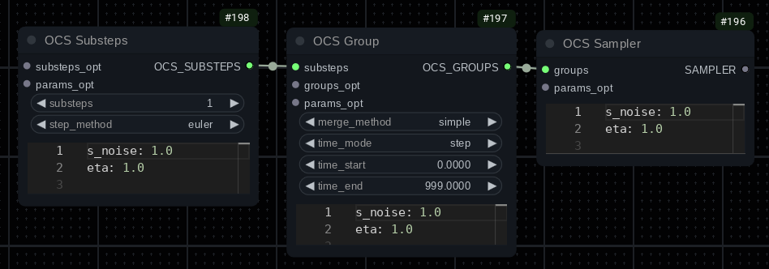
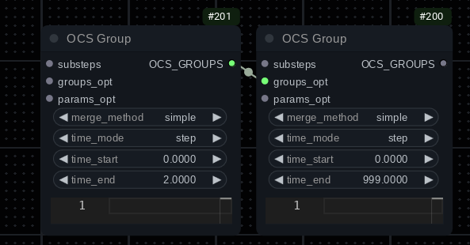

# Overly Complicated Sampling

Experimental and mathematically unsound (but fun!) sampling for [ComfyUI](https://github.com/comfyanonymous/ComfyUI).

**Status**: In flux, may be useful but likely to change/break workflows frequently. Mainly for advanced users.

Feel free create a question in Discussions for usage help: [OCS Q&A Discussion](https://github.com/blepping/comfyui_overly_complicated_sampling/discussions/categories/q-a)

## Features

* Many different samplers.
* Allows scheduling samplers (i.e. run `euler` for steps 1-4, then switch to `dpmpp_sde`).
* CFG++ support (for some samplers).
* Native support for Restart sigmas.
* Supports custom noise types.
* Immiscible noise for sampling and Restart. See https://arxiv.org/abs/2406.12303 (note that it was designed for training not inference).
* Allows splitting/combining steps in various ways for (potentially) more accurate sampling.
* Supports Diffrax, torchdiffeq, torchode and torchsde solver backends. (SDE mode not recommended currently.)
* Many tuneable parameters to play with.


## Credits

I can move code around but sampling math and creating samplers is far beyond my ability. I didn't write any of the original samplers:

* Euler, Heun++2, DPMPP SDE, DPMPP 2S, DPM++ 2m, 2m SDE and 3m SDE samplers based on ComfyUI's implementation.
* Reversible Heun, Reversible Heun 1s, RES, Trapezoidal, Bogacki, Reversible Bogacki, RK4 and Euler Dancing samplers based on implementation from https://github.com/Clybius/ComfyUI-Extra-Samplers
* TTM JVP sampler based on implementation written by Katherine Crowson (but yoinked from the Extra-Samplers repo mentioned above).
* IPNDM, IPNDM_V and DEIS adapted from https://github.com/zju-pi/diff-sampler/blob/main/diff-solvers-main/solvers.py (I used the Comfy version as a reference).
* Normal substep merge strategy based on implementation from https://github.com/Clybius/ComfyUI-Extra-Samplers
* Immiscible noise processing based on implementation from https://github.com/kohya-ss/sd-scripts/pull/1395 and idea for sampling with it from https://github.com/Clybius
* Precedence climbing (Pratt) expression parser based on implementation from https://github.com/andychu/pratt-parsing-demo

This repo wouldn't be possible without building on the work of others. Thanks!

## Usage

First, a note on the basic structure:



The sampler node connects to a group node. You can chain group nodes, however only one can match per step. Checking for a match starts at the group furthest from the sampler node. So if you have `Group1 -> Group2 -> Group3 -> Sampler`, the groups will be tried starting from `Group1`. Currently matching groups is only time based.

You will then connect a substeps node to the group. These can also be chained and like groups, execution starts with the node furthest from the group. I.E.: `Substeps1 -> Substeps2 -> Substeps3 -> Group` will start with `Substeps1`.

Most of these nodes have a text parameter input (YAML format - JSON is also valid YAML so you can use that instead if you prefer) and a parameter input. The parameter input can be used to specify stuff like custom noise types.

You may use filters and expressions in the text parameter input. See:

* [Filters](docs/filter.md)
* [Expressions](docs/expression.md)

## Integration

* [ComfyUI-bleh](https://github.com/blepping/ComfyUI-bleh) - allows access to many more blend and scaling modes as well as some extra features.
* [ComfyUI-sonar](https://github.com/blepping/ComfyUI-sonar) - allows access to many more noise types as well as the Power Filter feature.
* [ComfyUi_NNLatentUpscale](https://github.com/Ttl/ComfyUi_NNLatentUpscale) - allows access to the `t_scale_nnlatentupscale` function in expressions.

If you're going to use OCS, I strongly recommend also installing `ComfyUI-bleh` and `ComfyUI-sonar` as they increase the functionality a lot.


## Nodes

### `OCS Sampler`

The main sampler node, with an output suitable for connecting to a `SamplerCustom`. This node has builtin support for Restart sampling, if you are
using Restart don't use the `RestartSampler` node.

You can connect a chain of `OCS Group` nodes to it and it will choose one per step (based on conditions like time).

#### Input Parameters

* `restart_custom_noise`: Value type: `SONAR_CUSTOM_NOISE`. Allows specifying a custom noise type when used with Restart sampling.

#### Text Parameters

Shown in YAML with default values.

<details>
<summary>★★ Expand ★★</summary>

```yaml
# Noise scale. May not do anything currently.
s_noise: 1.0

# ETA (basically ancestralness). May not do anything currently.
eta: 1.0

# Reversible ETA (used for reversible samplers). May not do anything currently.
reta: 1.0

# Parameters related to restart sampling.
restart:
    # Scales the noise added by restart sampling.
    s_noise: 1.0
    # Immiscible block same as described below.
    immiscible:
        size: 0


# The noise block allows defining global noise sampling parameters.
noise:
    # You can disable this to allow GPU noise generation. I believe it only makes a difference for Brownian.
    cpu_noise: true

    # ComfyUI has a bug where if you disable add_noise in the sampler, no seed gets set. If you
    # are manually noising a sample and have add_noise turned off then you should enable this if
    # you want reproducible generations.
    set_seed: false

    # Global scale scale for generated noise
    scale: 1.0

    # Whether the generated noise should be normalized before use. Generally a good idea to leave enabled.
    normalize_noise: true

    # Dimensions to normalize over (when normalization is enabled). Negative values mean starting
    # from the end (i.e. -1 means the last dimension, -2 means the penultimate dimension).
    # Latents generally have these dimensions: batch, channels, height, width
    # The default of [-3, -2, -1] normalizes noise over the batch. You can try something like
    # [-2, -1] to normalize over the batch and channels. See: https://pytorch.org/docs/stable/generated/torch.std.html
    normalize_dims: [-3, -2, -1]

    # When caching, the batch size for chunks of noise to generate in advance. Generating a batch of noise
    # can be more efficient than generating on demand when using a high number of substeps (>10) per step.
    batch_size: 32

    # Whether to cache noise.
    caching: true

    # Interval (in full steps) to reset the cache. Brownian noise takes time into account so
    # if using Brownian you will generally want to reset each step.
    cache_reset_interval: 1

    # Immiscible noise processing, see: https://arxiv.org/abs/2406.12303
    immiscible:
        # Batch size, 0 disables.
        size: 0

        # Reference mode, values can be one of:
        #   x: Uses the current latent as a reference.
        #   noise: Uses the current noise as a reference (x - denoised)
        #   denoised: Uses the model image prediction as a reference (factors in positive and negative prompts).
        #   uncond: The model unconditional prediction (negative prompt)
        #   cond: The model conditional prediction (positive prompt)
        # Advanced feature: Additionally you may enter a string of operations in the format:
        #   "x - denoised * 2 + cond" (just an example, not a recommended setting)
        # Possible operations: + - / * min max add sub div mul
        # Note: Each value and operation must be space delimited (i.e. "x-1" will not work).
        #       Also normal operator precedence does not apply here.
        ref: default

        # Batching mode, one of:
        #   batch: Matches vs batches. Immiscible mode is disabled if size < 2
        #   channel: Splits the batch into a list of channels and matches against those.
        #   row: Splits the batch into a list of rows and matches against those.
        #   column: Splits the batch into a list of columns and matches against those.
        #           Note: Requires reshaping both the noise and x, may be slow and consume
        #                 a lot of VRAM.
        batching: channel

        # Scale for reference latent. Can be negative.
        scale_ref: 1.0

        # Allows normalizing the reference. If this is a list, you can specify the dimensions to
        # normalize. See normalize_dims above and https://pytorch.org/docs/stable/generated/torch.std.html
        normalize_ref: false

        # The proportion of immiscible-ized noise.
        # You get (immiscible_noise * strength) + ((1.0 - strength) * normal_noise) - LERP.
        strength: 1.0

        # See: https://docs.scipy.org/doc/scipy/reference/generated/scipy.optimize.linear_sum_assignment.html#scipy.optimize.linear_sum_assignment
        maximize: false

    filter: null


# Model calls can be cached. This is very experimental: I don't recommend using it
# unless you know what you're doing.
model:
    cache:
        # The cache size.
        size: 0

        # Threshold for model call caching. For example if you have size=3 and threshold=1
        # then model calls 1 through 3 will be cached, but model call 0 will not be (the first one).
        # Additional explanation: Some samplers call the model multiple times per step. For example,
        # Bogacki uses three model calls: 0, 1, 2
        threshold: 1

        # Maximum use count for cache items.
        max_use: 1000000

    filter:
        input: null
        denoised: null
        jdenoised: null
        cond: null
        uncond: null
```

</details><br/>

Any parameters you don't specify will use the defaults. For example if your text parameter block is:

```yaml
noise:
    cpu_noise: false
```

Then the rest of the parameters will use the defaults shown above.

### `OCS Group`

Defines a group of substeps.


#### Merging

When running multiple substeps per step, the results will combined based on the merge strategy. Possible strategies (in order of least weird to most weird):

* `simple`: Doesn't merge anything: only runs a single substep per step.
* `divide`: Creates a linear schedule between the current sigma and the next and runs the substeps in sequence. The model is called at least once per substep.
* `normal`: The model is called at least once per step (and possibly additional times for higher order samplers). Each substep shares the first model call result. The results are averaged together. *Note*: Since the first model call is shared and the initial input is the same for each substep, there is no point in running multiple identical substeps. Also note: This merge strategy doesn't work well with non-ancestral samplers (i.e. dpmpp_2m or any sampler with `eta: 0`).
* `overshoot`: The model is called at least once per step. It will sample steps equal to the number of substeps, starting from the current step. Then it will restart back to the expected step.
<!--
* `average`: The model is called once at the beginning of the step and substeps share that result (but it may be called additional times for higher order samplers). This means substeps for samplers like reversible Euler, Heun 1s, DPM++ 2m SDE are essentially free. May be theoretically very unsound and inaccurate, requires manual tweaking of settings like `s_noise`. Supports the parameter `avgmerge_stretch`(`0.4`) which basically rolls back the current sigma and adds some noise (otherwise running a substep is deterministic and there would be no point to running a sampler like Euler more than once).
* `sample`: Like `average` (and uses `avgmerge_stretch`) but instead of simply using the average, it does a sampler step toward that instead. You can plug in any substep sampler to the `merge_sampler_opt` input (if unconnected and the merge method is `sample` then Euler will be used). *Note*: Substeps in the attached sampler will be ignored.
* `sample_uncached`: Similar to `sample`, however it calls the model per substep instead of caching the result and sharing it. Aside from sampling toward the result, it works more like the `normal` merge strategy. Theoretically it should be better because it's taking less shortcuts but results seem worse.

When using `average` and `sample` merge strategies and with model call caching enabled you can get away with setting substeps super high. Running something like 100 substeps is actually quite practical and seems to work well.
-->

#### Node Parameters

* `merge_method`: One of the merge methods described above in the Merging section.
* `time_mode`(`step`): One of `step`, `step_pct`, `sigma`. Time matching mode. Matching based on steps generally will be simplest. Matches are inclusive and steps start at 0 (so step 0 is the first step). `step_pct` is the percentage of total steps (1.0=100%, 0.5=50%, etc).
* `time_start`(`0`): Match start time.
* `time_end`(`999`): Match end time.

Example:



The left side group matches steps 0, 1, 2. The right side group matches all steps. This setup will use whatever substeps are connected to the first group for the first three steps and the second group will handle the rest.


#### Input Parameters

<!--
* `merge_sampler`: Value type: `OCS_SUBSTEPS`. Only used when `merge_method` is `sample` or `sample_uncached`. Allows defining the sampler used for merging substeps.
-->

* `restart_custom_noise`: Currently only used by the `overshoot` merge method.

#### Text Parameters

Shown in YAML with default values.

<details>
<summary>★★ Expand ★★</summary>

```yaml
# Noise scale. May not do anything currently.
s_noise: 1.0

# ETA (basically ancestralness). May not do anything currently.
eta: 1.0

# Reversible ETA (used for reversible samplers). May not do anything currently.
reta: 1.0

# Sets the type of preview used for sampling in this group. One of:
#   denoised: The default, shows the model prediction (takes positive and negative prompt into account).
#   cond: Shows the model cond prediction (basically the positive prompt).
#   uncond: Shows the model uncond prediction (basically the negative prompt).
#   raw: Shows the raw noisy latent input.
preview_mode: denoised

# Expression.
when: null

# Interpolate the schedule by the specified factor. Only used by the overshoot merge method.
#: Example if factor 2 and steps [0,1,2] you'd get [0, 0.5, 1.0, 1.5, 2]
overshoot_expand_steps: 1

# Only used by the overshoot merge method currently.
restart:
    # Scales the noise added by restart sampling.
    s_noise: 1.0
    # Immiscible block same as described above.
    immiscible:
        size: 0

pre_filter: null

post_filter: null
```

</details>

### `OCS Substeps`

#### Step Methods (Samplers)

In alphabetical order.

* `adapter`: Wraps a normal ComfyUI `SAMPLER`. (Attach a `SAMPLER` parameter to the node.)
* `bogacki`:
* `deis`: See parameters: `history_limit`
* `dpmpp_2m_sde`: See parameters: `history_limit`
* `dpmpp_2m`: `eta` and `s_noise` parameters are ignored. See parameters: `history_limit`
* `dpmpp_2s`
* `dpmpp_3m_sde`: See parameters: `history_limit`
* `dpmpp_sde`
* `euler_cycle`: See parameters: `cycle_pct`
* `euler_dancing`: Pretty broken currently, will probably require increased `s_noise` values. See parameters: `deta`, `leap`, `deta_mode`
* `euler`:
* `heun`: Alternate Heun implementation. Supports reversible parameters. See parameters: `history_limit`
* `heun_1s`: Alternate Heun one step implementation. Supports reversible parameters.
* `heunpp`: See parameters: `max_order`
* `ipndm_v`: See parameters: `history_limit`
* `ipndm`: See parameters: `history_limit`
* `res`
* `reversible_bogacki`:
* `reversible_heun`:
* `reversible_heun_1s`: See parameters: `history_limit`
* `rk4`:
* `solver_diffrax`: Uses the [Diffrax](https://github.com/patrick-kidger/diffrax) solver backend. See `de_*` parameters below.
* `solver_torchdiffeq`: Uses the [torchdiffeq](https://github.com/rtqichen/torchdiffeq) backend. See `de_*` parameters below.
* `solver_torchode`: Uses the [torchode]((https://github.com/martenlienen/torchode)) backend. See `de_*` parameters below.
* `solver_torchsde`: Uses the [torchsde](https://github.com/google-research/torchsde) backend. See `de_*` parameters below.
* `trapezoidal`:
* `trapezoidal_cycle`: See parameters: `cycle_pct`
* `ttm_jvp`: TTM is a weird sampler. If you're using model caching you must make sure the entries TTM uses are populated first (by having it run before any other samplers that call the model multiple times). It may also not work with some other model patches and upscale methods. See parameters: `alternate_phi_2_calc`

**Sampler Feature Support**

|Name|Cost|History|Order|Reversible|CFG++|
|-|-|-|-|-|-|
|`adapter`|?|?|?|?|?|
|`bogacki`|2|||||
|`deis`|1|1-3 (1)||||
|`dpmpp_2m_sde`|1|1||||
|`dpmpp_2m`|1|1||||
|`dpmpp_2s`|2|||||
|`dpmpp_3m_sde`|1|1-2 (2)||||
|`dpmpp_sde`|2|||||
|`euler_cycle`|1||||X|
|`euler_dancing`|1|||||
|`euler`|1||||X|
|`heun`|2|||X||
|`heun_1s`|1|1||X||
|`heunpp`|1-3||X|||
|`ipndm_v`|1|1-3 (1)||||
|`ipndm`|1|1-3 (1)||||
|`res`|2|||||
|`reversible_bogacki`|2|||X||
|`reversible_heun`|2|||X||
|`reversible_heun_1s`|1|1||X||
|`rk4`|4|||||
|`solver_diffrax`|variable|||||
|`solver_torchdiffeq`|variable|||||
|`solver_torchode`|variable|||||
|`solver_torchsde`|variable|||||
|`trapezoidal`|2|||||
|`trapezoidal_cycle`|2|||||
|`ttm_jvp`|2|||||


`deis`, `ipndm*` do not seem to work well with ancestralness, I recommend `eta: 0.25` or disable it completely.

**Solver Backend Samplers**:

You will need to have the relevant Python package installed in your venv to use these. TDE cannot handle batches and
each batch item will be evaluated separately. Using `tode` may be faster for batch sizes over 1.

`ode_solver` types for TDE: adaptive: `dopri8`, `dopri5`, `bosh3`, `fehlberg2`, `adaptive_heun`, fixed step: `euler`, `midpoint`, `rk4`, `explicit_adams`, `implicit_adams`

`ode_solver` types for TODE: adaptive only: `dopri5`, `tsit5`, `heun`. I haven't much luck with anything other than `dopri5`.

Note that adaptive solvers may be _very_ slow. Think along the lines of 20-100 model calls per substep (or in other words, the equivalent for running that many `euler` steps). Tolerances only apply to adaptive solvers.

**Cycle Samplers** (`euler_cycle`, `trapezoidal_cycle`)

Basically a different approach to ancestral sampling. First a crash course on how sampling works:

Each step has an expected noise level, with the first step generally being pure noise and the end of the last step aiming to end with no noise remaining. Let's say the image on the current step is called `x`, calling the model with `x` gives us a prediction of what the image looks like with all noise removed (`denoised`), however the model is not capable of just removing all the noise in a single step: its prediction will be imprecise. `x - denoised` leaves us with just the noise (we subtract the prediction which theoretically has no noise from the noisy sample). This is a very simplified, but the idea is basically to add the noise back into `denoised`, but scaled so that it matches the amount of noise expected on the _next_ step. `denoised + noise * expected_noise_at_next_step`.

When doing ancestral sampling, we actually _overshoot_ expected noise for the next step and add less than that amount back to `denoised`. Then we generate some of our own noise and add it, scaled so that the result matches `expected_noise_at_next_step`. `eta` controls how the scale of the overshoot.

The difference with cycle is that instead of adding `noise * expected_noise_at_next_step`, we instead first add `noise * (expected_noise_at_next_step * (1.0 - cycle_pct))` and then we generate noise and scale it to `cycle_pct` and add it too. Just for example, suppose `cycle_pct` is `0.2`: we'll add 80% of the expected noise at the next step (`1.0 - 0.2 == 0.8`) and then generate the remaining 20% and add it in to meet the expected amount. I don't recommend setting `cycle_pct` to values over `0.5`, especially if using "weird" noise types.

#### Node Parameters

* `substeps`(`1`): Number of substeps. Generally involves a model call per substep, so for example setting this to 4 would approximately quadruple sampling time.
* `step_method`(`euler`): Method used for sampling the substeps. May include a parenthesized number (i.e. `rk4 (3)`) which denotes the number of _extra_ model calls required per sample. At least one is always required. So `euler` requires 1 in total, `rk4` requires 4 in total. RK4 is about 4 times slower than `euler`.

#### Input Parameters

* `custom_noise`: Value type: `SONAR_CUSTOM_NOISE`. Allows specifying a custom noise type for samplers that generate noise (most of them).

#### Text Parameters

Shown in YAML with default values.

<details>
<summary>★★ Expand ★★</summary>

```yaml
# Scale for added noise.
s_noise: 1.0

# ETA (basically ancestralness).
eta: 1.0
# No effect unless both start and end are set. Will scale the eta value based on the
# percentage of sampling. In other words, eta*dyn_eta_start at the beginning,
# eta*dyn_eta_end at the end.
dyn_eta_start: null
dyn_eta_end: null

# alt CFG++ scale (see https://cfgpp-diffusion.github.io/)
# Based on the initial incorrect ComfyUI implementation, but it seems to
# produce decent results sometimes.
# Can also be set to a negative value (I don't recommend going lower than -0.5).
alt_cfgpp_scale: 0

# CFG++ (see https://cfgpp-diffusion.github.io/)
cfgpp: false

### Reversible Settings ###

# Reversible ETA (used for reversible samplers).
reta: 1.0
# Scale of the reversible correction. Can also be set to a negative value.
reversible_scale: 1.0
# No effect unless both start and end are set. Will scale the reta value based on the
# percentage of sampling. In other words, reta*dyn_reta_start at the beginning,
# reta*dyn_reta_end at the end.
dyn_reta_start: null
dyn_reta_end: null

pre_filter: null

post_filter: null

### ODE Sampler Settings ###

# Solver type.
de_solver: dopri5 # Example - varies based on solver sampler.
# Relative tolerance (log 10)
de_rtol: -1.5
# Absolute tolerance (log 10)
de_atol: -3.5
# Max model calls allowed to compute the solution. If the limit is exceeded, it is an error.
de_max_nfe: 1000
# Min sigma to sample to. If the current step start <= min sigma, then the sampler will run
# a Euler step. If the current step end <= min sigma then the slover will sample to the min
# sigma and then to a Euler step from min sigma for the rest.
de_min_sigma: 0.0292
# Hack that seems to help results by stretching the down sigma a bit. Set to 0 to disable.
de_fixup_hack: 0.025

# Used to split the step into sections. Useful for fixed step methods.
# Applies to: solver_torchode, solver_diffrax
de_split: 1

# Initial step size (as a percentage).
# Applies to: solver_torchode, solver_diffrax
de_initial_step: 0.25

# Coefficients for the step size PID controller.
# See https://en.wikipedia.org/wiki/Proportional%E2%80%93integral%E2%80%93derivative_controller
# These values seem okay with dopri5.
# Applies to: solver_tode, solver_diffrax
de_ctl_pcoeff: 0.3
de_ctl_icoeff: 0.9
de_ctl_dcoeff: 0.2

# Controls whether to compile the solver. May or may not work,
# also may or may not be a speed increase as the compiled solver is
# not cached between substeps.
# Applies to: solver_torchode
tode_compile: false

### torchsde solver specific parameters.
tsde_noise_type: "scalar"
tsde_sde_type: "stratonovich"
tsde_levy_area_approx: "none"
tsde_noise_channels: 1
tsde_g_multiplier: 0.05
tsde_g_reverse_time: true
tsde_g_derp_mode: false
tsde_batch_channels: true

### diffrax solver specific parameters.

# Turns on adaptive stepping. When enabled, de_split is not used.
# When disabled, it may be desirable to set de_split.
diffrax_adaptive: false
# Hack to make some solver methods work. May not be safe.
diffrax_fake_pure_callback: true
# Some diffrax methods don't allow adaptive stepping, enabling this
# makes them usable although it's less efficient (3x cost, 2x accuracy).
diffrax_half_solver: false
diffrax_batch_channels: false
# Some solvers require specific types of Levy area approximation.
# See: https://docs.kidger.site/diffrax/api/brownian/#levy-areas
diffrax_levy_area_approx: "brownian_increment"
# Some solvers may require manually specifying the error order.
diffrax_error_order: null
# Enables SDE mode (and SDE-specific solvers). May not be worth using.
diffrax_sde_mode: false
# Noise multiplier when SDE mode is enabled.
diffrax_g_multiplier: 0.0
# Only applies when time scaling is enabled. Reverses time.
diffrax_g_reverse_time: false
# Scales the g multiplier based on the current time.
diffrax_g_time_scaling: false
# Experimental option to flip the sign on the g multiplier when time >= half the step.
# i.e. if you'd get 1,2,3,4 as g values for the step, with this it would be 1,2,-3,-4.
diffrax_g_split_time_mode: false


### Other Sampler Specific Parameters ###

# Used for some samplers that use history from previous steps.
# List of samplers and default value below:
#   dpmpp_2m: 1
#   dpmpp_2m_sde: 1
#   dpmpp_3m_sde: 2
#   reversible_heun_1s: 1
#   ipndm: 1 (max 3)
#   ipndm_v: 1 (max 3)
#   deis: 1 (max 3)
history_limit: 999 # Varies based on sampler.

# Used for some samplers with variable order. List of samplers and default value below:
#   heunpp2: 3
max_order: 999 # Varies based on sampler.

# Used for dpmpp_2m. One of midpoint, heun
solver_type: "midpoint"

# Coefficients mode for DEIS. One of tab or rhoab.
deis_mode: "tab"

# Used for samplers with cycle in the name. Controls how much noise is cycled per step.
cycle_pct: 0.25

# Used for ttm_jvp. Supposed works better when ETA > 0
alternate_phi_2_calc: true

# Parameters for dancing samplers:
# Number of steps to leap ahead.
leap: 2
# ETA for dance steps
deta: 1.0
# dyn_deta works the same as dyn_eta/reta. See above.
dyn_deta_start: null
dyn_deta_end: null
# One of lerp, lerp_alt, deta
dyn_deta_mode: "lerp"
```

</details>

### `OCS SimpleRestartSchedule`

Generates a restart schedule.

#### Node Parameters

* `start_step`: 0-based first step for the restart schedule to apply.

#### Input Parameters

* `sigmas`: Sigmas to restartify. Output from any normal schedule node.

#### Text Parameters

JSON or YAML schedule in list form.

```yaml
- [4, -3]
- [2, -1]
- 1
```

Each item should be one of:

* A pair `[interval, jump]` - after `interval` steps, make a relative jump of `jump` steps.
* A single integer `schedule_index`: resume the schedule at the specified 0-based index.

The example above means:
1. After 4 steps, jump back 3 steps.
2. After 2 steps, jump back one step.
3. Go to the second item (after 2 steps, jump back one step).

The node `start_step` parameter is effectively the same as `[start_step, 0]` as a schedule item.
